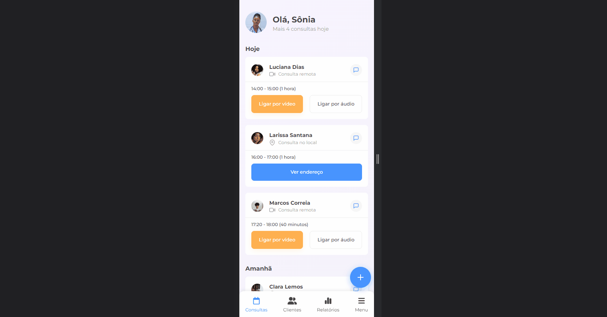

# DocApp | #7DaysOfCode

Repositório com a conclusão do projeto do desafio [7 Days Of Code de Responsividade](https://7daysofcode.io/matricula/responsividade) da Alura.

| :placard: Vitrine.Dev |     |
| -------------  | --- |
| :sparkles: Nome        | **DocApp | #7DaysOfCode**
| :label: Tecnologias | HTML e CSS
| :rocket: URL         | https://docapp-tau.vercel.app/
| :fire: Desafio     | https://7daysofcode.io/matricula/responsividade

## 📁 Detalhes do projeto

A proposta deste desafio foi desenvolver uma página responsiva para o controle de consultas médicas, usando apenas HTML e CSS.

Com base no [protótipo disponibilizado no Figma](https://www.figma.com/file/4OjHFmeHAgfX2JpRymOeA0/7days---Responsividade?node-id=0%3A1&mode=dev) a abordagem utilizada para este projeto foi o mobile-first.

Durante os dias do desafio foram solicitadas algumas alterações conforme o tamanho da tela. Para o mobile e tablet o menu de navegação está localizado no inferior da página e temos um botão flutuante para o cadastro de novas consultas. Já na versão desktop o menu passa a ser lateral e temos um formulário de cadastro no lugar do botão flutuante.

	

 

No botão flutuante foi aplicado o efeito de destaque ao escurecer a tela quando clicado e a criação de dois novos botões de cadastro. Ambos efeitos feitos apenas com HTML e CSS conforme sugestão do desafio.

	

 

## 👩‍💻 Tecnologias utilizadas

	
	

Desenvolvido com 💙 por [Juliana Lucca](https://www.linkedin.com/in/julianalucca/).